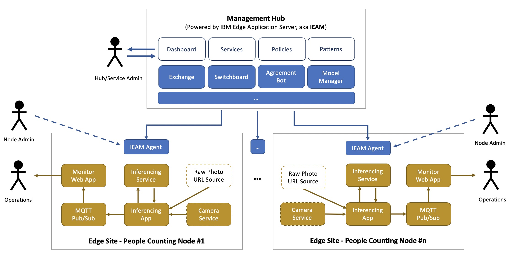
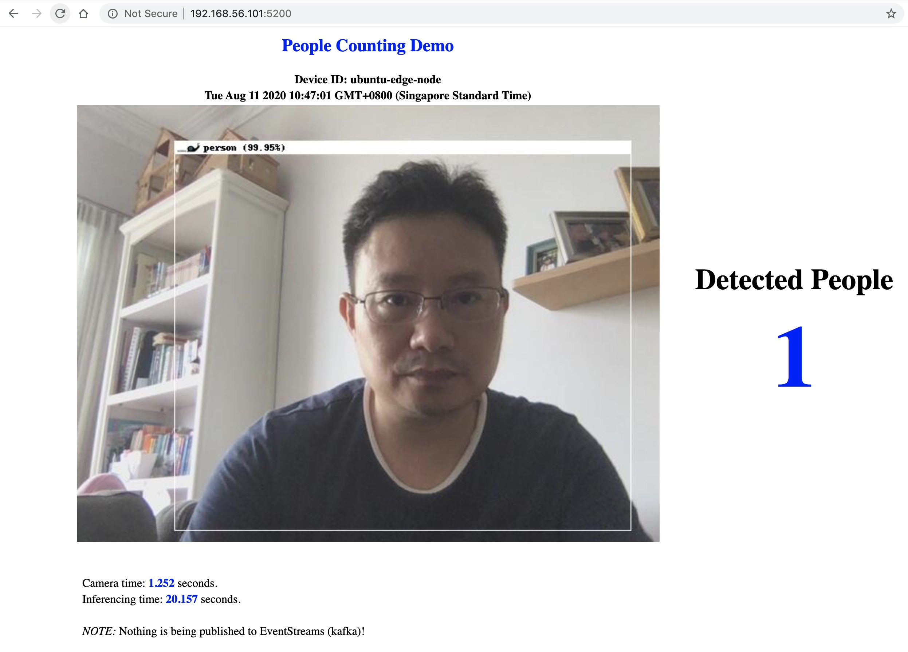

# Embrace Edge Computing By Adopting IBM Edge Application Manager (IEAM)

The intent of this doc is to walk you through how to build an Edge Node and run the demo services within it.
And you can imagine how easily to roll out such Edge Nodes to many sites, which is one of the amazing part of IEAM: to manage edge services, at scale.

## Architecture



## Assumptions

Let's assume that:
- The IBM Edge Application Server (IEAM) v4.1 is installed on OpenShift Container Platform (OCP) deployed on prem, or cloud;
- Within the laptop, we've logged into OCP by `oc login`;
- We're going to set up the Edge Node based on a Ubuntu VM.

## Get started

### Set up a VM with camera mounted

Let's assume that a Ubuntu Bionic VM has been set up in VirtualBox.

By the way, there is a permission issue which will cause the VM crash once the app tries to connect the Facetime HD Camera.
My current workaround is to start VirtualBox as root: `sudo virtualbox`.
Check out the forum post here for the follow-up: https://forums.virtualbox.org/viewtopic.php?f=8&t=99299&p=481734#p481734

We need to stop the VM and do some configuration.

In VirtualBox UI, select this VM and click Settings:

1. In Display tab: 
- `Video Memory`, change it to 64M;
- Make sure `Graphics Controller` is set as `VMSVGA`;
- Check `Enable 3D acceleration`
2. In Ports tab:
- Check `Enable USB Controller`, choose `USB 2.0 (EHCI) Controller`

And then start it up again.

```sh
# These are from my env, change them accordingly for yours
$ EDGE_NODE_NAME="ubuntu-edge-node" \
  EDGE_NODE_IP="192.168.56.101" \
  EDGE_NODE_USER="bright"

# Check the webcams and we can see the FaceTime HD Camera
$ vboxmanage list webcams
Video Input Devices: 1
.1 "FaceTime HD Camera (Built-in)"
0x8020000005ac8514

# Attach the default Facetime webcam to the VM
$ vboxmanage controlvm "${EDGE_NODE_NAME}" webcam attach .1
```

### Generate necessary files for Edge Node(s) by IEAM Hub Admin

A set of files will be needed to install the IBM Edge Application Manager (IEAM) agent on the edge device(s) and/or edge cluster(s), and register them with IEAM.
This typically could be done by IEAM Hub Amin.

Let's do this within our laptop.

```sh
# Clone the repo
git clone https://github.com/brightzheng100/people-counting-example
cd people-counting-example

# Create a temporary folder
mkdir _edge-node-files-x86_64-Linux && cd _edge-node-files-x86_64-Linux

# Download the latest version of edgeNodeFiles.sh
curl -O https://raw.githubusercontent.com/open-horizon/anax/v4.1/agent-install/edgeNodeFiles.sh && chmod +x edgeNodeFiles.sh

# Copy the horizon-edge-packages-4.1.0.tar.gz, which can be downloaded from IBM PPA #CC6G0ML, to current folder.
# This is just my case and you may copy it from your download folder.
cp ~/workspaces/cloud-paks/IEAM/_download/horizon-edge-packages-4.1.0.tar.gz ./

# Run the edgeNodeFiles.sh script to gather the necessary files:
# ./edgeNodeFiles.sh <edge-device-type> -t
#   <edge-device-type>: valid <edge-device-type> values: 32-bit-ARM, 64-bit-ARM, x86_64-Linux, macOS, x86_64-Cluster
#   -d <distribution>: valid options are 'bionic', 'xenial', 'stretch', defaults to 'bionic'. Flag is ignored with macOS and x86_64-Cluster.
export CLUSTER_URL="https://$(oc get routes icp-console -o jsonpath='{.spec.host}' -n kube-system)"
export CLUSTER_USER="admin"
export CLUSTER_PW="<YOUR IEAM ADMIN PASSWORD>"
./edgeNodeFiles.sh x86_64-Linux -t -d bionic

# Check the files generated
ls -l
-rw-r--r--  1 brightzheng  staff   35920785 Aug  5 17:24 agentInstallFiles-x86_64-Linux.tar.gz
-rw-r--r--  1 brightzheng  staff  359830572 Aug  5 17:23 horizon-edge-packages-4.1.0.tar.gz
-rw-------  1 brightzheng  staff        179 Aug  5 17:24 key.txt
...

# And the content of the final .gz file
tar -tvf agentInstallFiles-x86_64-Linux.tar.gz
-rw-r--r--  0 brightzheng staff     319 Aug  5 17:24 agent-install.cfg
-rw-r--r--  0 brightzheng staff    2021 Aug  5 17:24 agent-install.crt
-rwxr-xr-x  0 brightzheng staff   69657 Aug  5 17:24 agent-install.sh
-rw-r--r--  0 brightzheng staff   43360 Jun  4 15:04 bluehorizon_2.26.12~ppa~ubuntu.bionic_all.deb
-rw-r--r--  0 brightzheng staff 16386958 Jun  4 15:04 horizon-cli_2.26.12~ppa~ubuntu.bionic_amd64.deb
-rw-r--r--  0 brightzheng staff 19470100 Jun  4 15:04 horizon_2.26.12~ppa~ubuntu.bionic_amd64.deb
```

> Note: 
> - The `agentInstallFiles-XXX.tar.gz` will be the zipped file that to be handed over to IEAM Node Admin;
> - A key has been generated also, as `key.txt`, which should be handed over to IEAM Node Admin as well -- we can generate different keys for different IEAM Node Admins, which are managed centrally;
> - This procedure is to generate files for Edge Device. To generate files for Edge Cluster (e.g. K8s/OCP), instead of Edge Device, the procedure is slightly different. Please consult the doc [here](https://www.ibm.com/support/knowledgecenter/SSFKVV_4.1/hub/gather_files.html).


### Register the VM as Edge Node by IEAM Node Admin

```sh
# Assuming we're still in the folder created by previous step
$ pwd
.../people-counting-example/_edge-node-files-x86_64-Linux

# Copy over the files to our Edge Node
$ scp agentInstallFiles-x86_64-Linux.tar.gz key.txt ${EDGE_NODE_USER}@${EDGE_NODE_IP}:~/

# Let's ssh into the Edge Node
$ ssh ${EDGE_NODE_USER}@${EDGE_NODE_IP}
```

Now we're in Edge Node:

```sh
$ ls
agentInstallFiles-x86_64-Linux.tar.gz  key.txt

# untar the file
$ tar xf agentInstallFiles-x86_64-Linux.tar.gz

# Check the files
$ ls -l
-rw-r--r-- 1 bright bright      319 Aug  5 09:24 agent-install.cfg
-rw-r--r-- 1 bright bright     2021 Aug  5 09:24 agent-install.crt
-rwxr-xr-x 1 bright bright    69657 Aug  5 09:24 agent-install.sh
-rw-r--r-- 1 bright bright 35920785 Aug  5 09:27 agentInstallFiles-x86_64-Linux.tar.gz
-rw-r--r-- 1 bright bright    43360 Jun  4 07:04 bluehorizon_2.26.12~ppa~ubuntu.bionic_all.deb
-rw-r--r-- 1 bright bright 16386958 Jun  4 07:04 horizon-cli_2.26.12~ppa~ubuntu.bionic_amd64.deb
-rw-r--r-- 1 bright bright 19470100 Jun  4 07:04 horizon_2.26.12~ppa~ubuntu.bionic_amd64.deb
-rw------- 1 bright bright      179 Aug  5 09:27 key.txt

# Install software
$ sudo apt-get update && sudo apt-get install jq -y
$ sudo dpkg -i horizon-cli_2.26.12~ppa~ubuntu.bionic_amd64.deb

# Install Docker
$ sudo apt-get install -y \
    apt-transport-https \
    ca-certificates \
    curl \
    gnupg-agent \
    software-properties-common
$ curl -fsSL https://download.docker.com/linux/ubuntu/gpg | sudo apt-key add -
$ sudo add-apt-repository \
   "deb [arch=amd64] https://download.docker.com/linux/ubuntu \
   $(lsb_release -cs) \
   stable"
$ sudo apt-get update
$ sudo apt-get install -y docker-ce docker-ce-cli containerd.io
$ sudo usermod -aG docker $(whoami) # remember to log out and in again to use `docker` instead of `sudo docker`

# Export the auth with the key
$ eval export $(cat agent-install.cfg)
$ export HZN_EXCHANGE_USER_AUTH="iamapikey:$( cat key.txt | jq -r '.apikey' )"

# Define the node policy, refer to /horizon/node.policy.json,
# which are some arbitrary attributes to be as properties and constraints
# In real world, you may standardize these with some sensible naming patterns
$ cat > node.policy.json <<EOF
{
  "properties": [
    { 
      "name": "openhorizon.allowPrivileged", "value": "true"
    },
    { 
      "name": "vendor", "value": "Ubuntu"
    },
    { 
      "name": "code", "value": "Bionic"
    },
    { 
      "name": "geo", "value": "SGP"
    },
    
    { 
      "name": "visual_inferencing_workstation", "value": "yes"
    },
    { 
      "name": "webcam_attached", "value": "yes"
    }
  ],
  "constraints": [
  ]
}
EOF

# Install and configure the Horizon agent and to register this VM as the edge device, with node policy
$ sudo mkdir -p /private/etc/horizon/
$ sudo ./agent-install.sh -i . -u $HZN_EXCHANGE_USER_AUTH -z /agentInstallFiles-x86_64-Linux.tar.gz -n node.policy.json

# Once IEAM agent has been installed and node has been registered, we can check it out
$ hzn node list
{
  "id": "ubuntu-edge-node",
  "organization": "mycluster",
  "pattern": "",
  "name": "ubuntu-edge-node",
  "nodeType": "device",
  "token_last_valid_time": "2020-08-04 17:53:34 +0800 +08",
  "token_valid": true,
  "ha": false,
  "configstate": {
    "state": "configured",
    "last_update_time": "2020-08-04 17:53:36 +0800 +08"
  },
  "configuration": {
    "exchange_api": "https://icp-console.XXX.cloud/edge-exchange/v1/",
    "exchange_version": "2.30.0",
    "required_minimum_exchange_version": "2.23.0",
    "preferred_exchange_version": "2.23.0",
    "mms_api": "https://icp-console.XXX.cloud/edge-css",
    "architecture": "amd64",
    "horizon_version": "2.26.12"
  }
}
```

You can repeat this to set up more Edge Nodes.

Please note that there are 3 major ways to setup Edge Nodes, at scale: 
1. Manual agent installation and registration, like what I just did;
2. Bulk agent installation and registration;
3. SDO agent installation and registration

### Publish Services to IEAM by IEAM Service Admin

```sh
# Assuming we're still in the folder created by previous step
pwd
.../people-counting-example/_edge-node-files-x86_64-Linux

# Export the auth with the key
eval export $(cat agent-install.cfg)
export HZN_EXCHANGE_USER_AUTH="iamapikey:$( cat key.txt | jq -r '.apikey' )"

# cd to the top folder
cd $(git rev-parse --show-toplevel)

# Register the "bundled" services as a logical service
export DOCKERHUB_ID="quay.io/brightzheng100"
cat horizon/service.definition.json | \
  sed "s|__DOCKERHUB_ID__|${DOCKERHUB_ID}|g" | \
  hzn exchange service publish -f- -P -O
```

Once the service is published, we can check it out by:

```sh
# List to check what services now we have
hzn exchange service list
[
  "mycluster/people-counting-bundle-service_1.0.0_amd64"
]
```

### Deploy Edge Services to desired Edge Node(s)

IEAM Service/Node Admin can deploy services, based on deployment `policy` and/or `pattern`, to Edge Nodes.

Let's do it in our laptop, not the Edge Node -- but we can do anywhere as long as we have the right key.

```sh
# cd to the top folder
cd $(git rev-parse --show-toplevel)

# Register the "bundled" services as a logical service
eval $(hzn util configconv -f horizon/hzn.json)
hzn exchange deployment addpolicy -f horizon/deployment.policy.json ${HZN_ORG_ID}/policy-${SERVICE_NAME}_${SERVICE_VERSION}
```

## What's the outcome?

### The IEAM Agent in the Edge Node

The `systemd` managed `IEAM Agent` will be running in the Edge Node:

```sh
$ systemctl status horizon
● horizon.service - Service for Horizon control system (cf. https://bluehorizon.network)
   Loaded: loaded (/lib/systemd/system/horizon.service; enabled; vendor preset: enabled)
   Active: active (running) since Wed 2020-08-05 09:36:47 UTC; 1h 7min ago
  Process: 730 ExecStartPre=/usr/horizon/sbin/horizon-prestart / (code=exited, status=0/SUCCESS)
 Main PID: 844 (anax)
    Tasks: 8 (limit: 2317)
   CGroup: /system.slice/horizon.service
           └─844 /usr/horizon/bin/anax -v 3 -logtostderr -config /etc/horizon/anax.json
```

### The Docker Containers

We can check that the containers will be running within matched Edge Node(s):

```sh
bright@ubuntu-edge-node:~$ docker ps
CONTAINER ID        IMAGE                                           COMMAND                  CREATED             STATUS              PORTS                    NAMES
79a487db70eb        quay.io/brightzheng100/detector-service_amd64   "python /darknet.py …"   5 minutes ago       Up 5 minutes        0.0.0.0:5252->80/tcp     8b8e79dba89e1cecbe4d2050471e95a43ad9c329a1a9971e1bbdd31d5f5a9e77-detector-service
cbbe4b52ac17        quay.io/brightzheng100/detector-mqtt_amd64      "./mqtt.sh"              5 minutes ago       Up 5 minutes        0.0.0.0:1883->1883/tcp   8b8e79dba89e1cecbe4d2050471e95a43ad9c329a1a9971e1bbdd31d5f5a9e77-detector-mqtt
cb683ef536ad        quay.io/brightzheng100/detector-monitor_amd64   "python /app/monitor…"   5 minutes ago       Up 5 minutes        0.0.0.0:5200->5200/tcp   8b8e79dba89e1cecbe4d2050471e95a43ad9c329a1a9971e1bbdd31d5f5a9e77-detector-monitor
c92bf02644b9        quay.io/brightzheng100/detector-cam_amd64       "./start.sh"             5 minutes ago       Up 5 minutes        0.0.0.0:8888->80/tcp     8b8e79dba89e1cecbe4d2050471e95a43ad9c329a1a9971e1bbdd31d5f5a9e77-detector-cam
e61a26797f29        quay.io/brightzheng100/detector-app_amd64       "python app.py"          5 minutes ago       Up 5 minutes                                 8b8e79dba89e1cecbe4d2050471e95a43ad9c329a1a9971e1bbdd31d5f5a9e77-detector-app
```

### The IEAM Hub

We can visualize the managed Edge Nodes and services through IEAM Hub.

For example:


### Live Visual Inferencing for people counting

We now can access the Edge Node's `detector-monitor` container through exposed port at `5200`:

http://192.168.56.101:5200

As expected, the camera will capture live photos for visual inferencing and count the people:



Well, here just myself so nothing fancy but please imagine!


## Clean Up

### Remove the services deployed in Edge Node(s) by removing the deployment policy

```sh
# cd to the top folder
cd $(git rev-parse --show-toplevel)

# remove the bundle service
eval $(hzn util configconv -f horizon/hzn.json)
hzn exchange deployment removepolicy ${HZN_ORG_ID}/policy-${SERVICE_NAME}_${SERVICE_VERSION} -f
```

### Remove the services

To remove the services involved:

```sh
# cd to the top folder
cd $(git rev-parse --show-toplevel)

# the bundle service
eval $(hzn util configconv -f .horizon/hzn.json)
hzn exchange service remove "${HZN_ORG_ID}/${SERVICE_NAME}_${SERVICE_VERSION}_amd64" -f
```

### Unregister the Edge Node from IEAM

Log into the Edge Node:

```sh
hzn unregister -f
```
