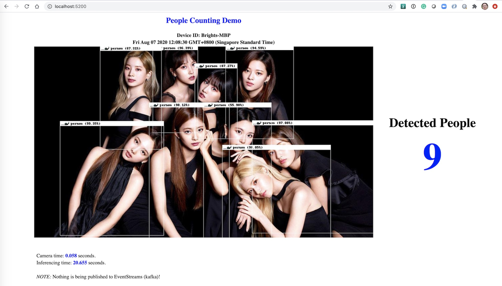

# Visual Inferencing Demo for Counting People

This is a very simple visual inferencing demo application, inspired by [MegaMosquito/achatina](https://github.com/MegaMosquito/achatina), for counting people by given static / camera-driven photos.

## Architecture


This is a microservices-based architecute, with a couple of components:

- `detector-service`: A visual inferencing service based on [YOLO/DarkNet](https://pjreddie.com/darknet/yolo/) models trained from the [COCO](http://cocodataset.org/#home) data set
- `detector-app`: An app to pull photos from static URLs or instantly-captured by `detector-cam` service
- `detector-monitor`: An web-based UI to monitor the detected people based on the input photo
- `detector-mqtt`: A simple mqtt broker for communication between `detector-app` and `detector-monitor`
- `detector-cam`: A RESTful service to drive webcam for instant photo taking

## Getting Started

### Build

```sh
# Expose variables, change to yours if you want
export DOCKERHUB_ID=quay.io/brightzheng100

# Build
make build-local

# Check the Docker images built
docker images | grep detector
quay.io/brightzheng100/detector-service_amd64       1.0.0     60ae546acc3f        About a minute ago   688MB
quay.io/brightzheng100/detector-mqtt_amd64          1.0.0     c7196c80ba5b        About a minute ago   10.1MB
quay.io/brightzheng100/detector-monitor_amd64       1.0.0     b402056b5f36        About a minute ago   84.1MB
quay.io/brightzheng100/detector-cam_amd64           1.0.0     1f97bf2571b5        About a minute ago   117MB
quay.io/brightzheng100/detector-app_amd64           1.0.0     e6ec56508214        2 minutes ago        718MB
```

### Run

One can run the containers individually, but using `docker-compose` might be much easier so there is a `docker-compose.yaml`.

There are two ways to feed a JGP formatted photo source for visual inferencing:

- A static URL to point to a **JGP** formatted photo, or
- A RESTful service endpoint driving the mounted webcam

> Note: Please refer to Advanced Topics for how to drive Facetime HD Camera in container in MacOS, [here](#advanced_topics).

```sh
# Create a dedicated Docker network
docker network create detector-network

# Expose variables
export DOCKERHUB_ID=quay.io/brightzheng100
export CAM_URL=https://upload.wikimedia.org/wikipedia/commons/9/9a/Backstreet_Boys_2019_by_Glenn_Francis.jpg
#export CAM_URL=https://steemitimages.com/DQmR4ms4BbAp763ttDF8juEu8KyoR2CrVc7TDdmxYfTRYDG/happy-people-1050x600.jpg

# Update the variables accordingly
cat docker-compose.yaml | \
    sed "s|__DOCKERHUB_ID|${DOCKERHUB_ID}|g" | \
    sed "s|__CAM_URL|${CAM_URL}|g" | \
    sed "s|__DEFAULT_CAM_URL|${CAM_URL}|g" | \
    sed "s|__HZN_DEVICE_ID|$(hostname)|g" | \
    > _docker-compose.yaml

# Start up Docker Compose, based on the generated _docker-compose.yaml
docker-compose -f _docker-compose.yaml up
```

### Monitor

We can access the simple monitor web app at: http://localhost:5200/


> Note: refer to [Advanced Topics](#advanced_topics) for how to capture live pothos for people counting.

### Release (optional)

Do this if you want to release the images.

```sh
# Expose variables, change to yours if you want
export DOCKERHUB_ID=quay.io/brightzheng100

# Login the repository, be it DockerHub or quay.io -- in my case it's quay.io
docker login quay.io

# Docker-pushing Docker images for local architecture
make push-local
```

### Clean Up

```sh
# Delete the running containers and remove the local images
make clean

# Delete the Docker network
docker network rm detector-network
```

## Advanced Topics

### Run `detector-cam` Camera Service in Mac

In MacOS, there has no `/dev/video0` device and we have less control on camera, especially when using Docker Desktop which is built based on HyperKit.

So if we want to run `detector-cam` Camera Service in MacOS, we may need to run that container in a Linux-based `docker-machine` VM.

#### Prerequisites

These components are required:
- [Docker Desktop for Mac](https://docs.docker.com/docker-for-mac/install/)
- [Docker Machine](https://docs.docker.com/machine/install-machine/)
- [VirtualBox](https://www.virtualbox.org/), and [VirtualBox Extension](https://www.virtualbox.org/wiki/Downloads)

#### Try It Out

Open a new terminal:

```sh
# Set variables
$ DOCKER_MACHINE=webcam

# Create docker-machine
$ docker-machine create -d virtualbox \
  --virtualbox-cpu-count=2 \
  --virtualbox-memory=2048 \
  --virtualbox-disk-size=100000 \
  --virtualbox-boot2docker-url https://github.com/gzupark/boot2docker-webcam-mac/releases/download/18.06.1-ce-usb/boot2docker.iso \
  ${DOCKER_MACHINE}

# Stop it to configure stuff
$ docker-machine stop ${DOCKER_MACHINE}

# In VirtualBox, select the VM we just created, namely webcam, then:
# 1. Settings -> Display: Video Memory, change it from 0 to 64M; Check "Enable 3D acceleration";
# 2. Settings -> Ports: Check "Enable USB Controller", choose "USB 2.0 (EHCI) Controller";

# Start webcam
$ docker-machine start ${DOCKER_MACHINE}

# Activate this docker-machine
$ eval $(docker-machine env ${DOCKER_MACHINE})

# List docker-machine
$ docker-machine ls
NAME     ACTIVE   DRIVER       STATE     URL                         SWARM   DOCKER        ERRORS
webcam   *        virtualbox   Running   tcp://192.168.99.101:2376           v18.06.1-ce

# Check the webcams and we can see the FaceTime HD Camera
$ vboxmanage list webcams
Video Input Devices: 1
.1 "FaceTime HD Camera (Built-in)"
0x8020000005ac8514

# Attach the default Facetime webcam to the VM
$ vboxmanage controlvm "${DOCKER_MACHINE}" webcam attach .1

# Run the restcam container
$ ( cd detector-cam && make run-in-mac )
```

Open another termimal (as to make sure we're with the "local" Docker env).

```sh
# Set variables
$ export DOCKER_MACHINE=webcam
$ export DOCKERHUB_ID=quay.io/brightzheng100

# Just make sure we're working with the local Docker env
$ eval $(docker-machine env -u)

# Now re-run the detector-app to pick up the source, from webcam
$ export CAM_URL=http://$(docker-machine ip ${DOCKER_MACHINE}):8888

# Genereate the docker compose file
$ cat docker-compose.yaml | \
    sed "s|__DOCKERHUB_ID|${DOCKERHUB_ID}|g" | \
    sed "s|__CAM_URL|${CAM_URL}|g" | \
    sed "s|__DEFAULT_CAM_URL|${CAM_URL}|g" | \
    sed "s|__HZN_DEVICE_ID|$(hostname)|g" | \
    > _docker-compose.yaml

# Start up Docker Compose
$ docker-compose -f _docker-compose.yaml up
```

## FAQ

### How to check what resolutions are supported with the attached webcam?

```sh
$ docker ps
CONTAINER ID        IMAGE                                        COMMAND             CREATED             STATUS              PORTS                  NAMES
911787df9f47        quay.io/brightzheng100/restcam_amd64:1.0.0   "./start.sh"        6 seconds ago       Up 5 seconds        0.0.0.0:8888->80/tcp   restcam

$ docker exec -it 911787df9f47 sh

$ apt-get install v4l-utils

$ v4l2-ctl --info
Driver Info (not using libv4l2):
	Driver name   : uvcvideo
	Card type     : VirtualBox Webcam - FaceTime HD
	Bus info      : usb-0000:00:06.0-1
	Driver version: 4.9.93
	Capabilities  : 0x84200001
		Video Capture
		Streaming
		Extended Pix Format
		Device Capabilities
	Device Caps   : 0x04200001
		Video Capture
		Streaming
		Extended Pix Format

$ v4l2-ctl --list-formats-ext
ioctl: VIDIOC_ENUM_FMT
	Index       : 0
	Type        : Video Capture
	Pixel Format: 'MJPG' (compressed)
	Name        : Motion-JPEG
		Size: Discrete 640x480
			Interval: Discrete 0.033s (30.000 fps)
			Interval: Discrete 0.040s (25.000 fps)
			Interval: Discrete 0.050s (20.000 fps)
			Interval: Discrete 0.067s (15.000 fps)
			Interval: Discrete 0.100s (10.000 fps)
			Interval: Discrete 0.200s (5.000 fps)
		Size: Discrete 1280x720
			Interval: Discrete 0.033s (30.000 fps)
			Interval: Discrete 0.040s (25.000 fps)
			Interval: Discrete 0.050s (20.000 fps)
			Interval: Discrete 0.067s (15.000 fps)
			Interval: Discrete 0.100s (10.000 fps)
			Interval: Discrete 0.200s (5.000 fps)
```

So the built-in FaceTime HD Camera supports `640x480` and `1280x720`.
