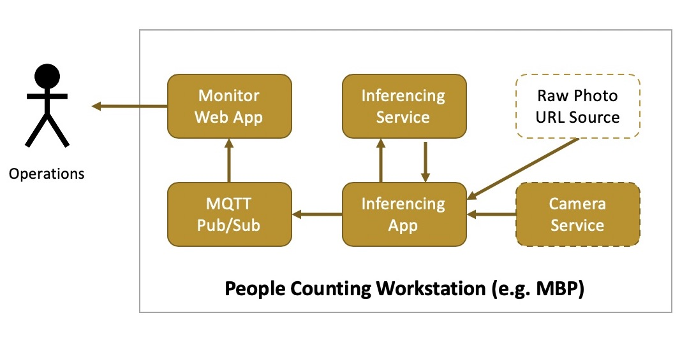
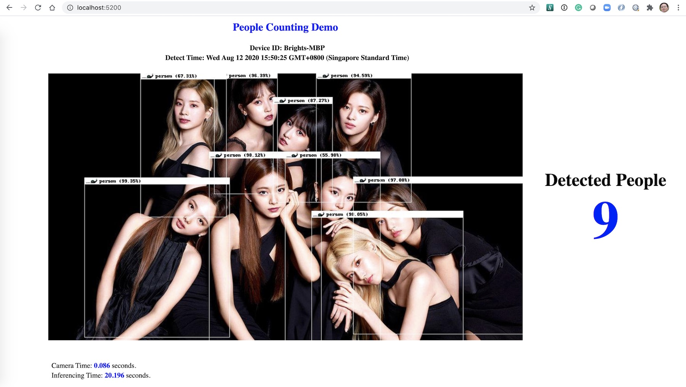

# Visual Inferencing Demo for Counting People

This is a very simple visual inferencing demo application, inspired by [YOLO/Darknet](https://github.com/AlexeyAB/darknet), an open source neural network framework written in C and CUDA, and the wrapping effort from [MegaMosquito/achatina](https://github.com/MegaMosquito/achatina), for counting people by given static / camera-driven photos.

## Architecture



This is a microservices-based architecture, with a couple of components:

- `detector-service`: A visual inferencing service based on [YOLO/DarkNet](https://pjreddie.com/darknet/yolo/) models trained by the [COCO](http://cocodataset.org/#home) dataset
- `detector-app`: An app to pull photos from static URLs or instantly-captured by `detector-cam` service
- `detector-monitor`: An web-based UI to monitor the detected people based on the input photo
- `detector-mqtt`: A simple mqtt broker for communication between `detector-app` and `detector-monitor`
- `detector-cam`: A RESTful service to drive webcam for instant photo taking

> Note: I've built and tested it in my MacBook Pro, Ubuntu Bionic/Xenial VM, so it should work in other environment too.

## Getting Started

### Build

```sh
# Clone and switch to it
git clone https://github.com/brightzheng100/vi-people-counting-example.git
cd vi-people-counting-example

# Expose variables, change to yours if you want
export DOCKERHUB_ID=quay.io/brightzheng100

# Build
make build-local

# Check the Docker images built
docker images | grep detector
quay.io/brightzheng100/detector-service_amd64       1.0.0     60ae546acc3f        About a minute ago   688MB
quay.io/brightzheng100/detector-mqtt_amd64          1.0.0     c7196c80ba5b        About a minute ago   10.1MB
quay.io/brightzheng100/detector-monitor_amd64       1.0.0     b402056b5f36        About a minute ago   84.1MB
quay.io/brightzheng100/detector-cam_amd64           1.0.0     1f97bf2571b5        About a minute ago   118MB
quay.io/brightzheng100/detector-app_amd64           1.0.0     e6ec56508214        2 minutes ago        95.7MB
```

### Run

You can run the containers individually, but using `docker-compose` might be much easier so there is a `docker-compose.yaml`.

There are two ways to feed a JPG formatted photo source for visual inferencing:

- A static URL to point to a **JPG** formatted photo, or
- A RESTful service endpoint driving the mounted webcam

```sh
# Create a dedicated Docker network
docker network create detector-network

# Expose variables
export DOCKERHUB_ID="quay.io/brightzheng100"

# Some sample photos randomly picked from Internet, feel free to try it out
# Credit to all the hosting websites!!
export CAM_URL="https://kdrapop.com/wp-content/uploads/2019/10/twice-2019-bb-japan-95-billboard-1548-1-1024x577.jpg"
#export CAM_URL="https://upload.wikimedia.org/wikipedia/commons/9/9a/Backstreet_Boys_2019_by_Glenn_Francis.jpg"
#export CAM_URL=https://steemitimages.com/DQmR4ms4BbAp763ttDF8juEu8KyoR2CrVc7TDdmxYfTRYDG/happy-people-1050x600.jpg

# Update the variables accordingly and up
cat docker-compose.yaml | \
    sed "s|__DOCKERHUB_ID__|${DOCKERHUB_ID}|g" | \
    sed "s|__CAM_URL__|${CAM_URL}|g" | \
    sed "s|__DEFAULT_CAM_URL__|${CAM_URL}|g" | \
    sed "s|__HZN_DEVICE_ID__|$(hostname)|g" | \
    sed "s|__SLEEP_BETWEEN_CALLS__|5|g" | \
	docker-compose -f - up
```

> Note: Please refer to Advanced Topics for how to drive Facetime HD Camera in container in MacOS, [here](#advanced_topics). But if your Docker container can access camera directly, try this instead:

```sh
# Expose variables
export DOCKERHUB_ID="quay.io/brightzheng100"
export CAM_URL="http://detector-cam:80/"

# Update the variables accordingly and up
cat docker-compose-with-cam.yaml | \
    sed "s|__DOCKERHUB_ID__|${DOCKERHUB_ID}|g" | \
    sed "s|__CAM_URL__|${CAM_URL}|g" | \
    sed "s|__DEFAULT_CAM_URL__|${CAM_URL}|g" | \
    sed "s|__HZN_DEVICE_ID__|$(hostname)|g" | \
    sed "s|__SLEEP_BETWEEN_CALLS__|5|g" | \
	docker-compose -f - up
```

### Monitor

We can access the simple monitor web app at: http://localhost:5200/


> Note: refer to [Advanced Topics](#advanced_topics) for how to use camera to capture live pothos for people counting.

### Release (optional)

Do this if you want to release the images.

```sh
# You have to change to yours
export DOCKERHUB_ID=quay.io/brightzheng100

# Login the repository, be it DockerHub or quay.io -- in my case it's quay.io
docker login quay.io

# Docker-pushing Docker images for local architecture
make push-local
```

### Clean Up

Press `CTL + c` to stop the Docker Compose if it's still running, and then:

```sh
# Delete the running containers and remove the local images
make clean

# Delete the Docker network
docker network rm detector-network
```

## Advanced Topics

### Run `detector-cam` Camera Service in Mac

In MacOS, there has no `/dev/video0` device and we have less control on camera, especially when using Docker Desktop which is built based on HyperKit.

So if we want to run `detector-cam` Camera Service in MacOS, we may need to run that container in a Linux-based `docker-machine` VM.

We can try it out in a Docker Machine VM, on VirtualBox.

#### Prerequisites

These components are required:
- [Docker Desktop for Mac](https://docs.docker.com/docker-for-mac/install/)
- [Docker Machine](https://docs.docker.com/machine/install-machine/)
- [VirtualBox](https://www.virtualbox.org/), and [VirtualBox Extension](https://www.virtualbox.org/wiki/Downloads)

#### Try It Out

Open a new terminal:

```sh
# Set variables
$ DOCKER_MACHINE=webcam

# Create docker-machine
$ docker-machine create -d virtualbox \
  --virtualbox-cpu-count=2 \
  --virtualbox-memory=2048 \
  --virtualbox-disk-size=100000 \
  ${DOCKER_MACHINE}

# Stop it to configure stuff
$ docker-machine stop ${DOCKER_MACHINE}

# In VirtualBox, select the VM we just created, namely `webcam`, then:
# 1. In Display tab: 
# - `Video Memory`, change it to 64M;
# - Make sure `Graphics Controller` is set as `VMSVGA`;
# - Check `Enable 3D acceleration`
# 2. In Ports tab:
# - Check `Enable USB Controller`, choose `USB 2.0 (EHCI) Controller`

# Start webcam
$ docker-machine start ${DOCKER_MACHINE}

# Activate this docker-machine
$ eval $(docker-machine env ${DOCKER_MACHINE})

# List docker-machine
$ docker-machine ls
NAME     ACTIVE   DRIVER       STATE     URL                         SWARM   DOCKER        ERRORS
webcam   *        virtualbox   Running   tcp://192.168.99.101:2376           v18.06.1-ce

# Check the webcams and we can see the FaceTime HD Camera
$ vboxmanage list webcams
Video Input Devices: 1
.1 "FaceTime HD Camera (Built-in)"
0x8020000005ac8514

# Attach the default Facetime webcam to the VM
$ vboxmanage controlvm "${DOCKER_MACHINE}" webcam attach .1

# Run the restcam container
(
  export DOCKERHUB_ID=quay.io/brightzheng100
  cd detector-cam && make run-in-mac
)
```

Open another termimal (as to make sure we're with the "local" Docker env).

```sh
# Set variables
$ export DOCKER_MACHINE=webcam
$ export DOCKERHUB_ID=quay.io/brightzheng100

# Just make sure we're working with the local Docker env
$ eval $(docker-machine env -u)

# Now re-run the detector-app to pick up the photo source, from webcam
$ export CAM_URL=http://$(docker-machine ip ${DOCKER_MACHINE}):8888

# Update some variables and up
cat docker-compose.yaml | \
    sed "s|__DOCKERHUB_ID__|${DOCKERHUB_ID}|g" | \
    sed "s|__CAM_URL__|${CAM_URL}|g" | \
    sed "s|__DEFAULT_CAM_URL__|${CAM_URL}|g" | \
    sed "s|__HZN_DEVICE_ID__|$(hostname)|g" | \
    sed "s|__SLEEP_BETWEEN_CALLS__|5|g" | \
    docker-compose -f - up
```

Similarly, we can access the monitor web app at: http://localhost:5200/.

But this time, the Facetime HD camera will capture instant photos for visual inferencing!

Do remember to detach the camera as part of the clean up:

```sh
vboxmanage controlvm "${DOCKER_MACHINE}" webcam detach
```

### Run such Visual Inferencing workstation at Edge Sites, at scale

While rolling out such workstations to many Edge Sites, we need an Edge Solution to manage all these, at scale.

The architcture will be evolving to something like this:


Please refer to [here](IEAM.md) for the detailed guide.
